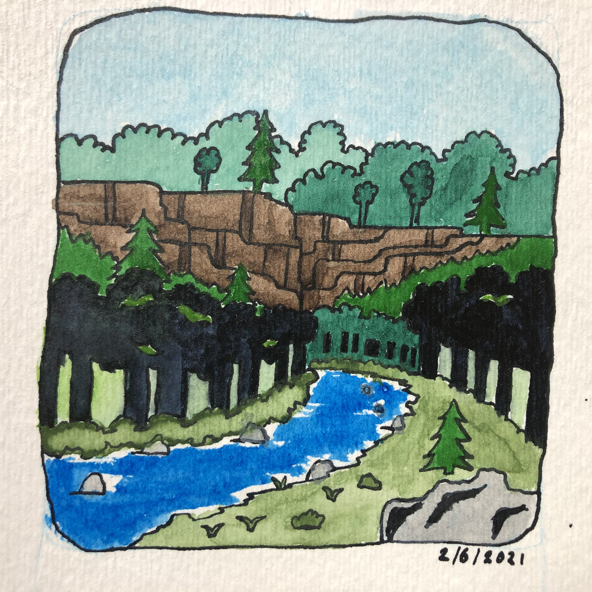
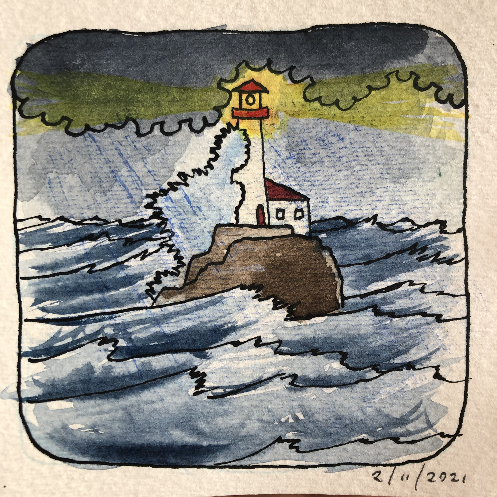
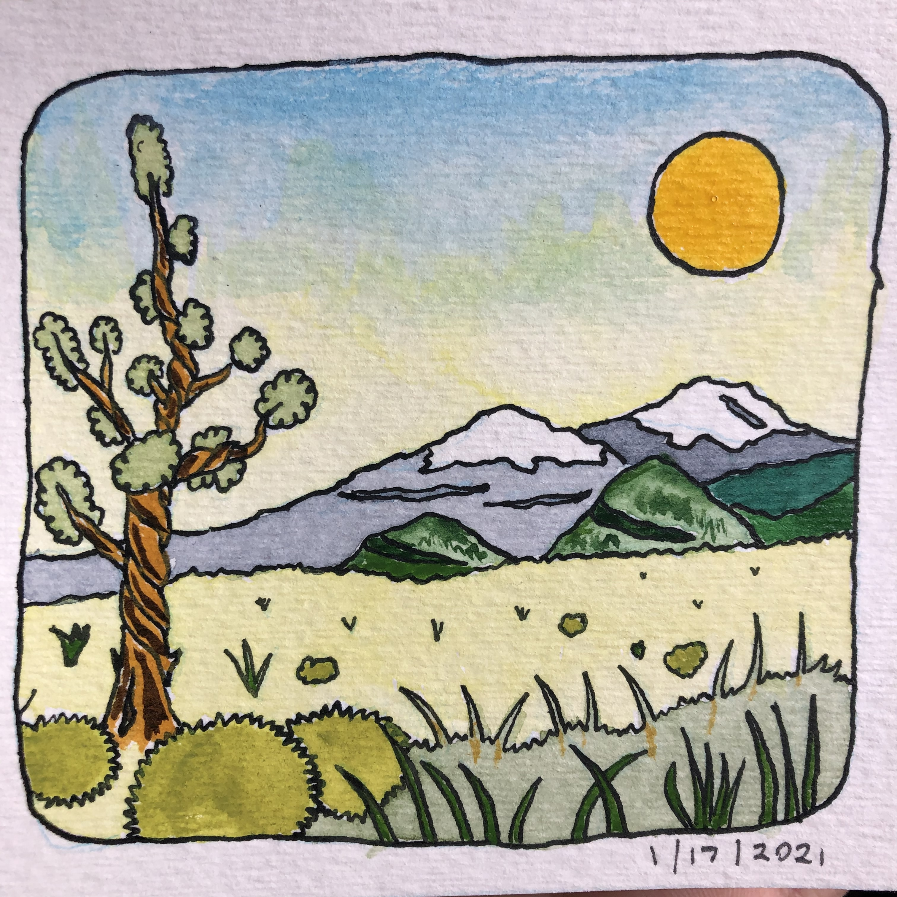
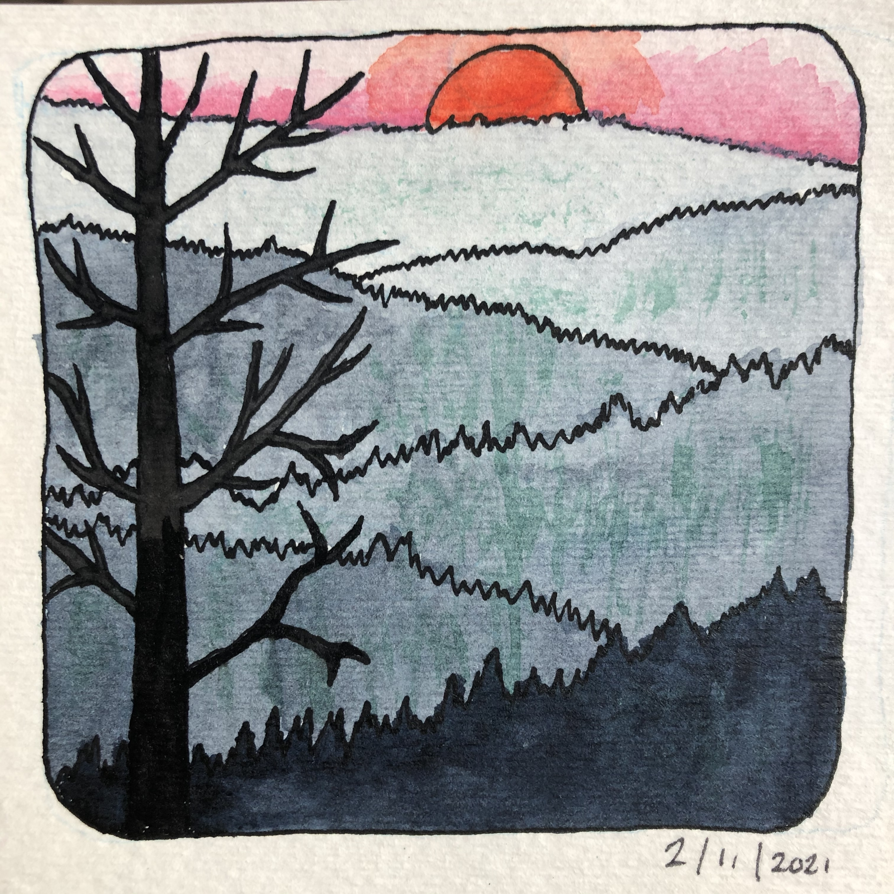
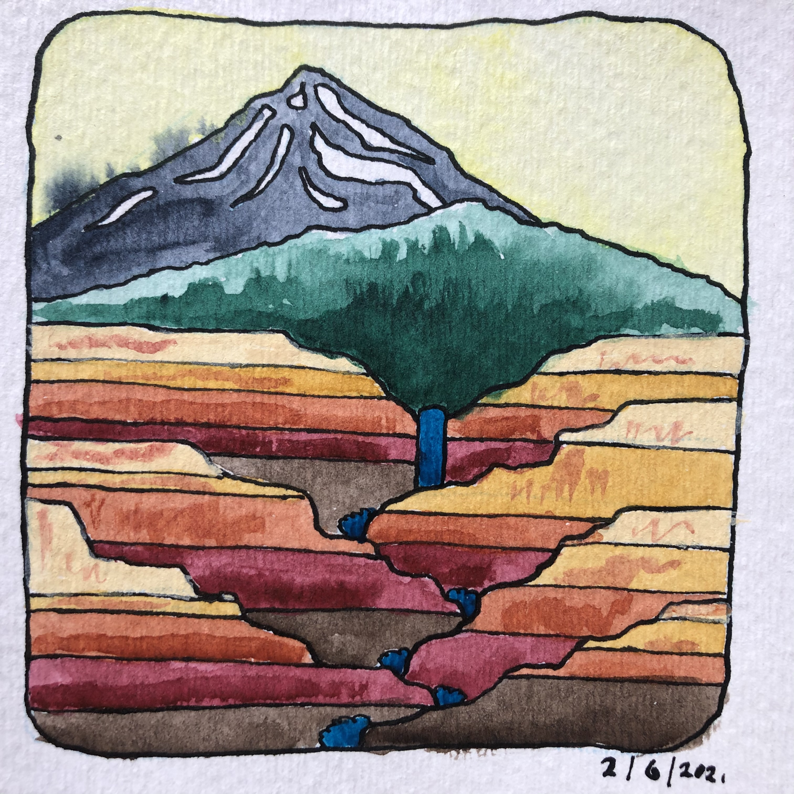
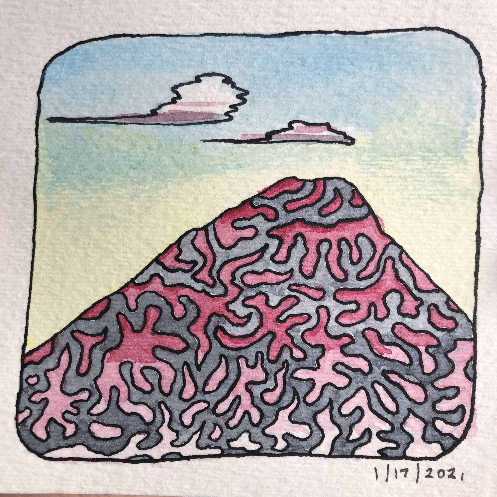

For some reason I found myself scrolling through my photos app and landed on a drawing series I did in 2021. They're little more than doodles, coloring-page shape logic. It's a good mental exercise, though.

